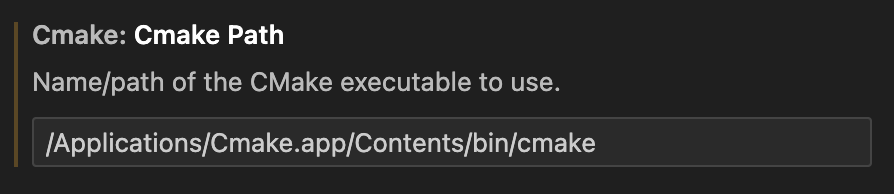

# Tooling for C++ development

## GNU Make

### Windows

Install:
1. llvm-mingw (clang compiler with extra tools) for x86_64 windows 
2. w64devkit (gcc compiler with extra tools) for x86_64 windows 
3. (Optional? I already had it) Install GNU Make.

Makefile provides:
1. By default builds with GCC + uses static analyazer - cppcheck
2. Can also build with CLANG + uses address sanitizer and clang-tidy

How to run:
1. For GCC compiler call: <code>make</code> or for CLANG call: <code>make clang</code>
2. For running the built executable: <code>make run</code>
3. To clean build/ folder call: <code>make clean</code>

### MacOS

% TODO

## CMake + vcpkg

### Windows

// Tested on Windows 11 on AMD chip.

**Install CMake:**
1. Dowloand the binaries from official website and un-archive the folder.
2. Add <code> bin\ </code> folder to the system <code>PATH</code> environment variable (e.g. <code> C:\Program Files\CMake\bin </code>)
3. If VS Code complains about not detecting the CMake, try modifying the <code>Cmake Path</code> to point to <code>cmake.exe</code>

**Install vcpkg:**
1. Clone the vcpkg repo: <code> git clone https://github.com/Microsoft/vcpkg.git </code>
2. Run the bootstrap script to build vcpkg: <code>bootstrap-vcpkg.bat</code>. 
3. I also added the folder to the <code>PATH</code> (not sure if it is needed).

**Setup project:**
1. Create a basic <code> CMakeLists.txt </code> as provided in this project.
2. Modify (if needed) the <code> CMAKE_TOOLCHAIN_FILE </code> to point to the <code> vcpkg.cmake </code>
3. Install Visual Studio tools (using VS installer):
    - C++ CMake tools for Windows
    - Universal Windows: Platform build tools
3. Run command <code> vcpkg install </code> to install package(s) specified in <code> vcpkg.json </code> file
5. Configure CMake and build project.

NOTE: For <code> vcpkg.json </code> the "builtin-baseline" is the baseline commit of vcpkg repo. I used the latest commit hash on master at that time.

### MacOS

// Tested on macOS Ventura on M1 chip.

**Install CMake:**
1. Install CMake through homebrew: <code> brew install cmake </code>
2. VS Code should detect it automatically

If you installed CMake manually, you should provide a path to executable, see example below:

**Install vcpkg:**
1. Clone the vcpkg repo: <code> git clone https://github.com/Microsoft/vcpkg.git </code>
2. Run the bootstrap script to build vcpkg: <code> ./vcpkg/bootstrap-vcpkg.sh </code>

**Setup project:**
1. Create a basic <code> CMakeLists.txt </code> as provided in this project.
2. Modify (if needed) the <code> CMAKE_TOOLCHAIN_FILE </code> to point to the <code> vcpkg.cmake </code>
3. Run command <code> vcpkg install </code> to install package(s) specified in <code> vcpkg.json </code> file
4. Configure the CMake and build the project.

## CI / CD

As a part of CI/CD a <code>dummy_test.yaml</code> is created. It is a workflow file that triggers a job based on provided conditions (in this case push to master).

Due to the limitations of default GitHub actions, I don't perform:
1. Static analysis (using cpp-check/clang-tidy) as default github tools don't have those.
2. Cmake testing as the whole setup is quite cumbersome.

The job actually fails on purpose. In the cpp file I clearly make a mistake by reading the array at index out of bounds. The gcc compiler with all of those warning flags set does not detect it, while clang does, thus fails.

